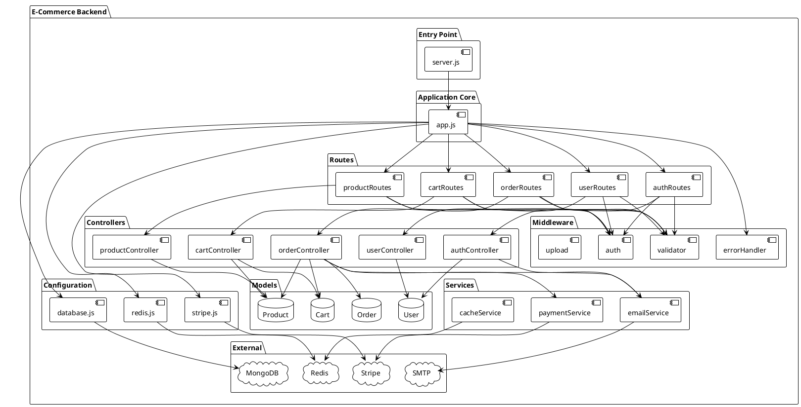
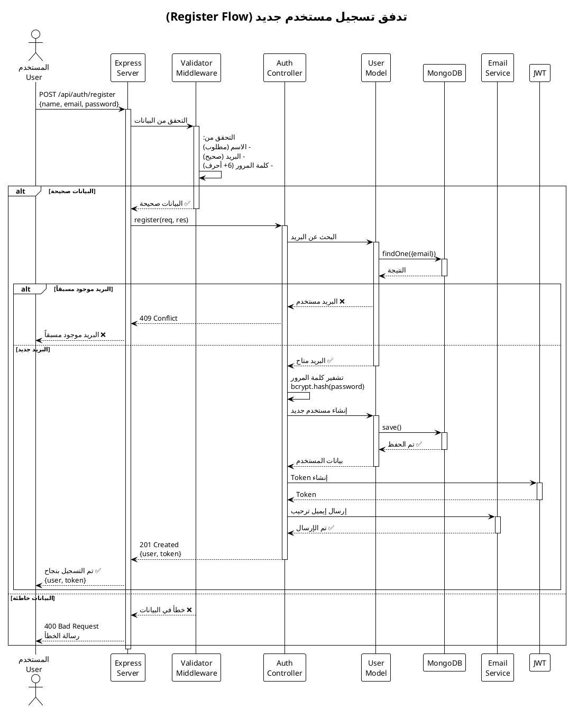
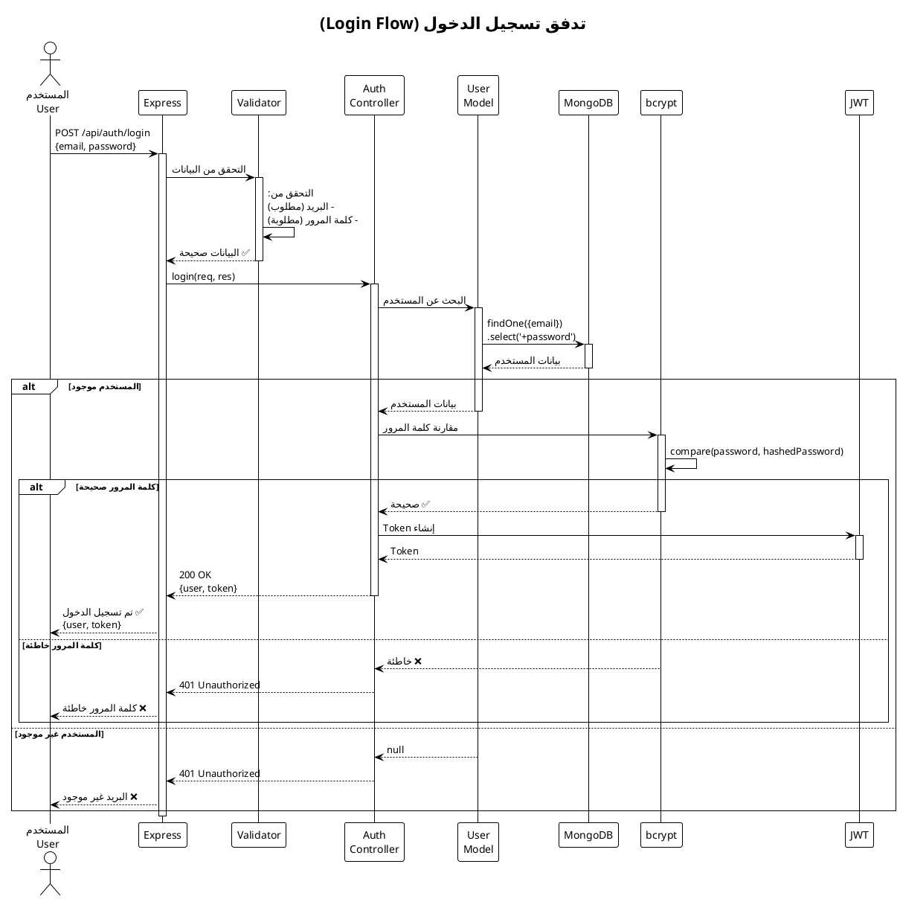
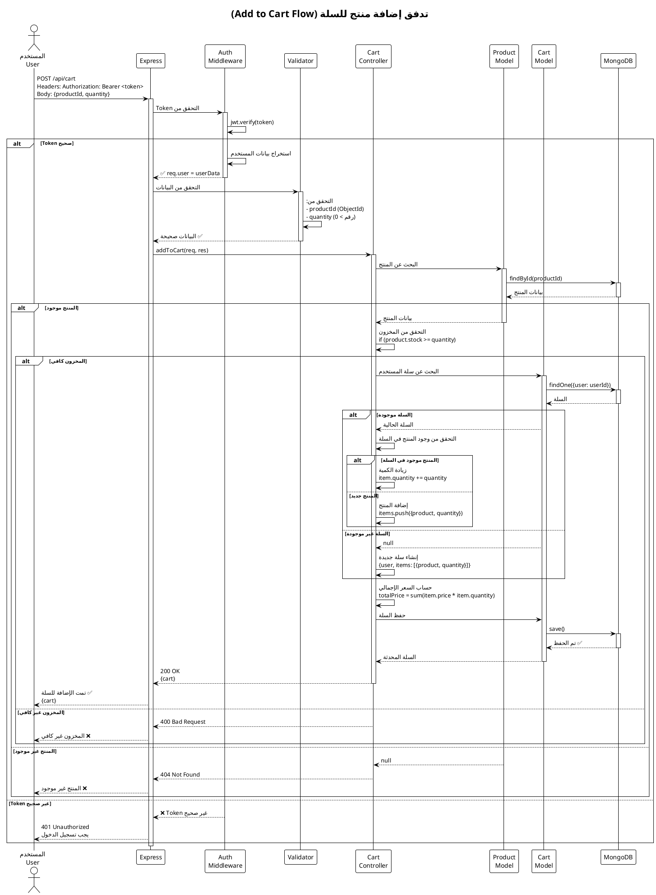
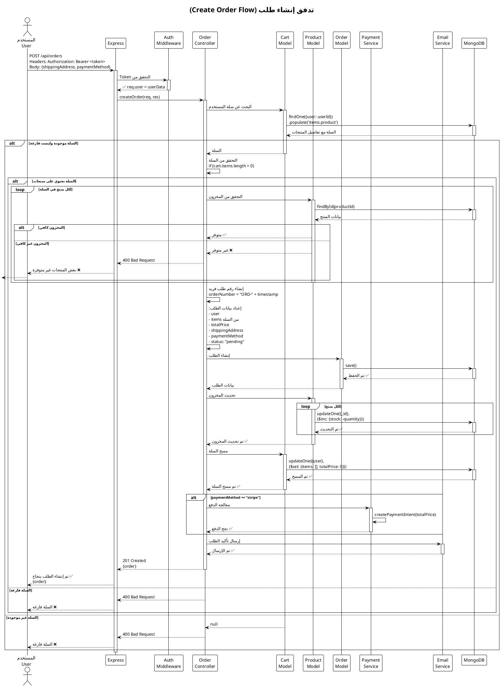
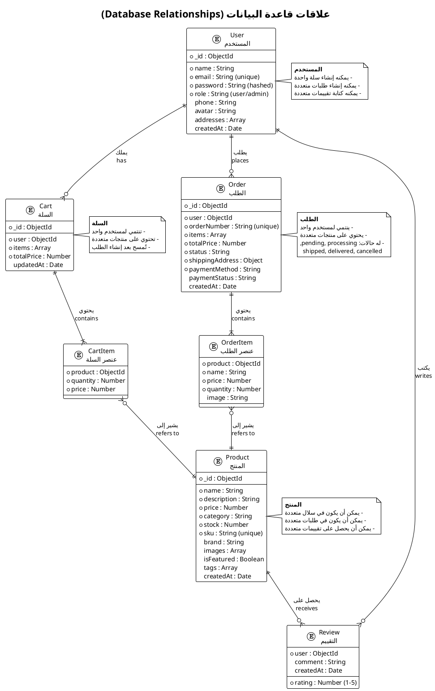
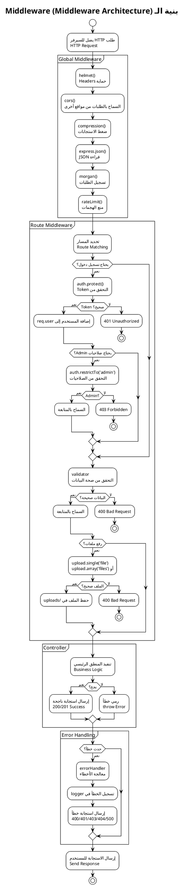

# 📊 مخططات PlantUML للمشروع

## 🎯 نظرة عامة

هذا الملف يحتوي على مخططات **PlantUML** لفهم تدفق البيانات والعلاقات في المشروع.

---

## 📖 فهرس المخططات

1. [هيكل المشروع العام](#1-هيكل-المشروع-العام)
2. [تدفق تسجيل مستخدم جديد](#2-تدفق-تسجيل-مستخدم-جديد)
3. [تدفق تسجيل الدخول](#3-تدفق-تسجيل-الدخول)
4. [تدفق إضافة منتج للسلة](#4-تدفق-إضافة-منتج-للسلة)
5. [تدفق إنشاء طلب](#5-تدفق-إنشاء-طلب)
6. [علاقات قاعدة البيانات](#6-علاقات-قاعدة-البيانات)
7. [بنية الـ Middleware](#7-بنية-الـ-middleware)
8. [نظام الصلاحيات](#8-نظام-الصلاحيات)

---

## 1. هيكل المشروع العام

### مخطط الهيكل الكلي

**الشرح بالعربية:**
- `server.js` يبدأ التطبيق
- `app.js` يُعد Express والـ Routes
- الـ Routes توجه الطلبات للـ Controllers
- الـ Middleware يعمل قبل Controllers
- الـ Controllers تستخدم Models و Services
- الـ Models تتصل بـ MongoDB
- الـ Services تتصل بخدمات خارجية

---

## 2. تدفق تسجيل مستخدم جديد

### مخطط التسلسل (Sequence Diagram)

**الشرح بالعربية:**
1. المستخدم يرسل بيانات التسجيل
2. Validator يتحقق من صحة البيانات
3. Controller يتحقق من عدم وجود البريد
4. تشفير كلمة المرور
5. حفظ المستخدم في قاعدة البيانات
6. إنشاء JWT Token
7. إرسال إيميل ترحيب
8. إرجاع Token للمستخدم

---

## 3. تدفق تسجيل الدخول

**الشرح بالعربية:**
1. المستخدم يرسل البريد وكلمة المرور
2. البحث عن المستخدم في قاعدة البيانات
3. مقارنة كلمة المرور المشفرة
4. إنشاء JWT Token
5. إرجاع Token للمستخدم

---

## 4. تدفق إضافة منتج للسلة

**الشرح بالعربية:**
1. التحقق من Token (المستخدم مسجل دخول)
2. التحقق من صحة البيانات
3. البحث عن المنتج والتحقق من المخزون
4. البحث عن سلة المستخدم أو إنشاء واحدة جديدة
5. إضافة المنتج أو زيادة الكمية
6. حساب السعر الإجمالي
7. حفظ السلة

---

## 5. تدفق إنشاء طلب

**الشرح بالعربية:**
1. التحقق من تسجيل الدخول
2. البحث عن سلة المستخدم
3. التحقق من أن السلة ليست فارغة
4. التحقق من توفر جميع المنتجات
5. إنشاء رقم طلب فريد
6. حفظ الطلب في قاعدة البيانات
7. تحديث مخزون المنتجات
8. مسح السلة
9. معالجة الدفع (إذا كان Stripe)
10. إرسال إيميل تأكيد

---

## 6. علاقات قاعدة البيانات

**الشرح بالعربية:**
- **User (المستخدم)**: يملك سلة واحدة، طلبات متعددة، تقييمات متعددة
- **Product (المنتج)**: يمكن أن يكون في سلال وطلبات متعددة
- **Cart (السلة)**: تنتمي لمستخدم واحد، تحتوي على منتجات
- **Order (الطلب)**: ينتمي لمستخدم، يحتوي على منتجات، له حالات مختلفة

---

## 7. بنية الـ Middleware

**الشرح بالعربية:**
1. **Global Middleware**: يعمل على جميع الطلبات (أمان، ضغط، تسجيل)
2. **Route Middleware**: يعمل على مسارات محددة (تحقق، صلاحيات، validation)
3. **Controller**: ينفذ المنطق الرئيسي
4. **Error Handler**: يعالج الأخطاء ويرسل استجابات مناسبة

---

## 8. نظام الصلاحيات

```plantuml
@startuml
!theme plain
title نظام الصلاحيات (Authorization System)

actor "مستخدم عادي\nUser" as user
actor "مدير\nAdmin" as admin

package "Public APIs\nمتاحة للجميع" {
  usecase "عرض المنتجات\nView Products" as UC1
  usecase "عرض منتج واحد\nView Product Details" as UC2
  usecase "التسجيل\nRegister" as UC3
  usecase "تسجيل الدخول\nLogin" as UC4
}

package "User APIs\nللمستخدمين المسجلين" {
  usecase "عرض الملف الشخصي\nView Profile" as UC5
  usecase "تعديل الملف الشخصي\nUpdate Profile" as UC6
  usecase "إضافة عنوان\nAdd Address" as UC7
  usecase "عرض السلة\nView Cart" as UC8
  usecase "إضافة للسلة\nAdd to Cart" as UC9
  usecase "إنشاء طلب\nCreate Order" as UC10
  usecase "عرض طلباتي\nView My Orders" as UC11
  usecase "إلغاء طلب\nCancel Order" as UC12
  usecase "إضافة تقييم\nAdd Review" as UC13
}

package "Admin APIs\nللمديرين فقط" {
  usecase "إضافة منتج\nCreate Product" as UC14
  usecase "تعديل منتج\nUpdate Product" as UC15
  usecase "حذف منتج\nDelete Product" as UC16
  usecase "عرض جميع المستخدمين\nView All Users" as UC17
  usecase "عرض جميع الطلبات\nView All Orders" as UC18
  usecase "تحديث حالة الطلب\nUpdate Order Status" as UC19
}

' Public APIs - متاحة للجميع
user --> UC1
user --> UC2
user --> UC3
user --> UC4

admin --> UC1
admin --> UC2
admin --> UC3
admin --> UC4

' User APIs - للمستخدمين المسجلين
user --> UC5
user --> UC6
user --> UC7
user --> UC8
user --> UC9
user --> UC10
user --> UC11
user --> UC12
user --> UC13

admin --> UC5
admin --> UC6
admin --> UC7
admin --> UC8
admin --> UC9
admin --> UC10
admin --> UC11
admin --> UC12
admin --> UC13

' Admin APIs - للمديرين فقط
admin --> UC14
admin --> UC15
admin --> UC16
admin --> UC17
admin --> UC18
admin --> UC19

note right of user
  **المستخدم العادي**
  - يمكنه الوصول للـ APIs العامة
  - يمكنه الوصول لـ APIs المستخدمين
  - لا يمكنه الوصول لـ APIs المديرين
end note

note right of admin
  **المدير**
  - يمكنه الوصول لجميع APIs
  - له صلاحيات إضافية
  - يمكنه إدارة المنتجات والطلبات
end note

@enduml
```

**الشرح بالعربية:**
- **Public APIs**: متاحة للجميع (عرض المنتجات، التسجيل، الدخول)
- **User APIs**: للمستخدمين المسجلين (السلة، الطلبات، الملف الشخصي)
- **Admin APIs**: للمديرين فقط (إدارة المنتجات، المستخدمين، الطلبات)

---

## 🎯 كيفية استخدام هذه المخططات

### 1. **عرض المخططات**

يمكنك عرض هذه المخططات بطرق متعددة:

#### أ) **PlantUML Online**
1. افتح: https://www.plantuml.com/plantuml/uml/
2. انسخ كود PlantUML
3. الصقه في المحرر
4. شاهد المخطط

#### ب) **VS Code Extension**
1. ثبت إضافة "PlantUML" في VS Code
2. افتح ملف `.puml`
3. اضغط `Alt+D` لعرض المخطط

#### ج) **IntelliJ IDEA**
1. ثبت إضافة "PlantUML integration"
2. افتح ملف `.puml`
3. شاهد المخطط مباشرة

---

## 📝 ملاحظات

### ✅ **فوائد المخططات**
- فهم تدفق البيانات بصرياً
- رؤية العلاقات بين المكونات
- تسهيل التعلم للمبتدئين
- توثيق المشروع

### ✅ **نصائح**
- ابدأ بمخطط الهيكل العام
- ثم انتقل لمخططات التدفق
- ادرس مخطط قاعدة البيانات لفهم العلاقات
- استخدم مخطط الـ Middleware لفهم الأمان

---

## 🎓 للمبتدئين

### كيف تقرأ المخططات؟

#### **Sequence Diagram (مخطط التسلسل)**
- الأسهم تمثل الرسائل/الطلبات
- الخطوط العمودية تمثل الوقت (من الأعلى للأسفل)
- المستطيلات تمثل المكونات (Controllers, Models, etc.)

#### **Entity Relationship (علاقات الكيانات)**
- المستطيلات تمثل الجداول/Models
- الخطوط تمثل العلاقات
- `||--o{` تعني "واحد إلى متعدد" (One-to-Many)
- `||--||` تعني "واحد إلى واحد" (One-to-One)

#### **Use Case (حالات الاستخدام)**
- الدوائر تمثل الوظائف
- الأشخاص تمثل المستخدمين
- الأسهم تمثل من يمكنه الوصول

---

## ✨ الخلاصة

هذه المخططات تساعدك على:
- ✅ فهم بنية المشروع
- ✅ رؤية تدفق البيانات
- ✅ فهم العلاقات بين المكونات
- ✅ معرفة الصلاحيات والأمان

**الخطوة التالية:** ارجع لـ `ARABIC_GUIDE.md` لقراءة الشرح التفصيلي! 📚

---

*تم إنشاء هذه المخططات خصيصاً للمطورين المبتدئين 💙*
